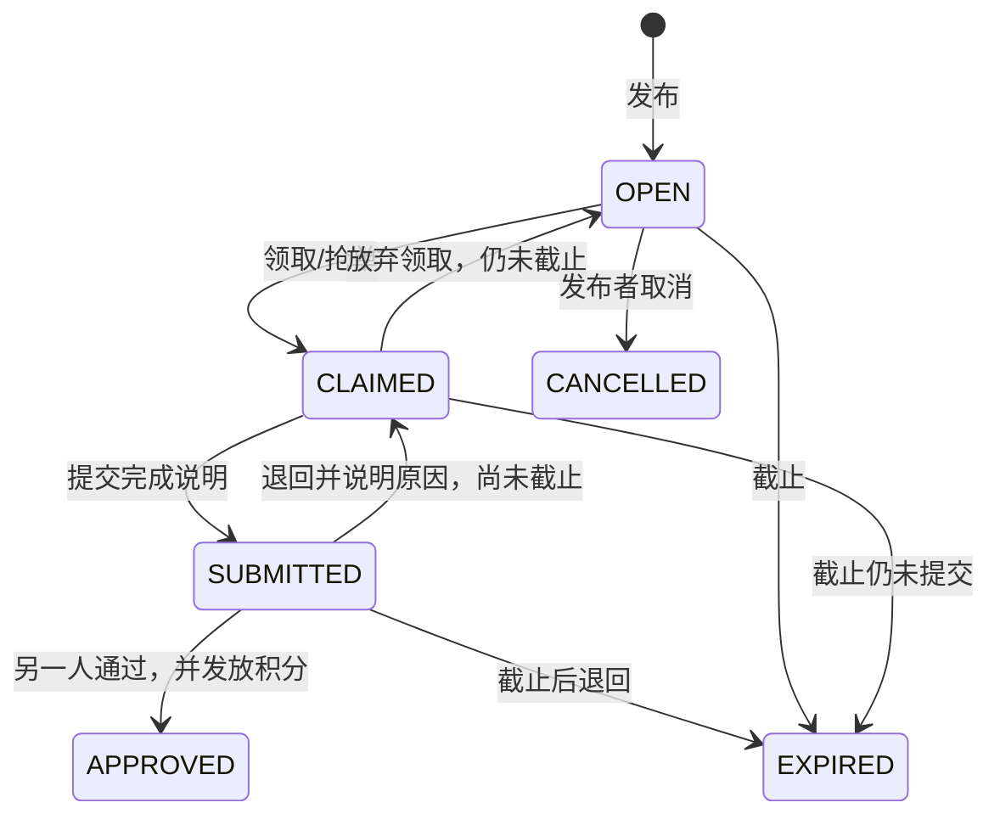
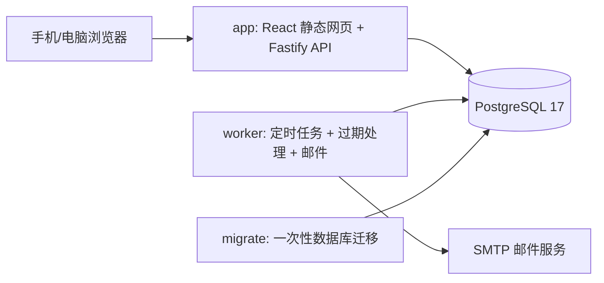

# 两个人 · 情侣任务与心愿小店

版本：首版 v1.1，2026-09-22。本文先于业务实现编写，微信登录补充设计随后纳入实现依据。

## 1. 产品目标与范围

为一对情侣提供私密的共同空间。两个人都能发布任务、完成任务赚取积分、上架商品或服务，并用积分兑换空间中的心愿，包括自己发布的心愿，始终由另一半兑现。产品采用手机优先的响应式网页，电脑也能访问；提供应用图标与桌面快捷入口，业务操作需要联网。

首版交付完整闭环：邮箱密码注册登录、邀请配对、指定任务、双方抢单、一次性定时任务、每日/每周任务、完成审核、独立积分账户与流水、商品库存与上下架、兑换及退款、站内通知、SMTP 邮件提醒、Docker 部署。

首版暂不包含小程序、原生 App、图片上传、积分充值/提现/转账、多人家庭、聊天、复杂积分惩罚、任意 Cron、自助更换伴侣与解除配对。微信登录作为可选外部身份入口接入。没有真实货币支付；商品通常是双方自行兑现的约会、家务、礼物与服务。

## 2. 用户与空间

- 每个账号只能属于一个空间；数据库用两个固定成员席位保证空间最多两人。
- 创建空间后获得限时邀请码；伴侣注册后输入邀请码加入。邀请成功即失效，满员空间不再接纳第三人。
- 两人权限平等。发布任务、领取、上架与兑换需要空间已配对；等待伴侣时展示邀请入口和引导。
- 所有任务、商品、订单、通知和积分流水均受空间隔离约束。后端检查当前用户及空间，不能靠前端隐藏按钮代替权限校验。
- 密码安全散列保存，登录会话保存在 HttpOnly Cookie；提供退出登录。邮箱通知为个人设置，验证邮箱后才能开启外发。可选的北辰微信身份只在后端建立关联；微信新账号允许暂时没有邮箱和密码。

## 3. 任务设计

### 3.1 分配方式与发布时间相互独立

| 维度 | 选项 | 规则 |
| --- | --- | --- |
| 分配 | 指定给伴侣 | 仅另一位成员可以领取 |
| 分配 | 双方抢单 | 双方均可领取，包含发布者；先成功者独占 |
| 发布 | 立即 | 创建一个可领取实例 |
| 发布 | 定时一次 | 指定日期时间创建一个实例 |
| 发布 | 每日 | 每日北京时间固定时刻创建实例 |
| 发布 | 每周 | 每周选定星期与时刻创建实例 |

**为什么抢单允许发布者领取**：只有两个人的空间，如果排除发布者，永远只剩一个候选人。无论谁领取，都必须由另一人验收，禁止自己给自己发积分。

任务字段包括标题、要求、奖励积分（1～10,000 的整数）、分配方式与可选截止时间。计划任务使用“发布后多少小时截止”，首版限定 1～168 小时。发布后的任务要求和奖励冻结；要调整时取消尚未领取的实例并重新发布。

### 3.2 生命周期

- 领取者才能提交，提交者不能审核；退回必须提供原因。
- 截止前已提交的任务即使跨天，也能继续审核并获得奖励。
- 领取前可以由发布者取消；领取后不能由发布者单方取消。领取者可以在提交前放弃。
- 审核通过、余额增加、流水记录在同一数据库事务完成。同一任务最多一次奖励。
- 抢单采用数据库条件更新/行锁，两人同时点击时只有一个成功，另一人看到明确提示。
- 周期模板与实例分开保存。暂停仅影响未来；恢复从下一个未来时刻开始。修改规则首版通过暂停旧计划、新建计划完成。

### 3.3 调度约定

统一存 UTC，首版日程固定按 `Asia/Shanghai`（北京时间）计算与标注。独立 worker 每 15 秒检查计划；正常运行的发布延迟通常不超过一个轮询周期。

同一期计划通过 `(schedule_id, scheduled_for)` 唯一约束防重。停机恢复只补发最近一次且尚未过期的期次，跳过过期旧期次，不集中生成过去几十天的任务。一次性定时任务过期后不再补发。每次执行记录 worker 心跳。

## 4. 积分与心愿小店

每人有独立积分账户，初始为 0。任务通过时系统增加完成人积分，不扣发布者积分。兑换消费的积分从兑换人账户扣除，不转给上架者。所有增减必须有不可随意修改的来源流水，不开放手动改分接口。

商品由双方自行上架，字段包括名称、说明、图标、积分价格（1～100,000）、库存、上下架状态。使用有限库存，可修改补货。两人都能兑换空间内的上架商品，包括自己发布的心愿；下架不影响已有订单。

兑换流程为 `PENDING 待兑现 → FULFILLED 已兑现 → COMPLETED 已确认`。扣除兑换人的积分，始终由另一位空间成员负责兑现，兑换人确认完成。商品创建人仍可管理商品，订单的 `seller_id` 表示实际兑现人。待兑现时兑换人可取消，兑现人可拒绝；取消会在同一事务中恢复积分、库存并记录退款。已兑现的订单不能单方取消。旧订单保持原角色，无需修改历史订单。

库存扣减、余额扣减、订单创建与积分流水写入必须全部成功或全部失败。余额及库存不允许为负。兑换请求携带幂等键，重复点击或网络重试不会重复扣分；重复取消不会重复退款。订单保存当时的商品名称、说明与积分价格快照。

## 5. 通知

- 站内通知：任务发布、领取、提交待审核、通过/退回、兑换待兑现、兑现/确认/取消。
- 邮件：相同关键事件可发送给需要行动的另一人，用户可关闭；未验证邮箱不发送业务邮件。
- SMTP 参数使用环境变量，可接常见邮箱授权码或邮件服务；配置缺失时应用继续工作，界面提示邮件未配置。
- 业务事务仅写通知与邮件队列，worker 异步发送。失败按退避策略重试，达到上限保留失败记录，提供状态查询和重试入口。
- 邮件不承担业务状态变更；SMTP 不可用不影响任务、积分与兑换。稳定 Message-ID 辅助去重，但 SMTP 故障窗口可能产生重复邮件，不能承诺严格只发送一次。
- 提供六款可爱邮件模板，双方分别选择并在设置内预览；选择存储在 `users.email_theme`，发送时按收件人的最新偏好生成 HTML，同时携带完整纯文字正文。所有动态内容转义，不依赖外链图片。任务和订单邮件按钮进入对应页面，登录完成后继续定位。
- 发布（含定时任务）通知另一人领取；领取通知领取人的另一半；提交完成通知另一人验收；通过/退回通知完成人；兑换通知负责兑现的另一半，并写出心愿名称及积分。重复领取、通过验收、兑换重试和退款都沿用事务与幂等保护，不重复生成事件邮件。

## 6. 页面与视觉

名称暂定「两个人」，温暖的奶油白背景、莓果粉主色、深灰正文，卡片与清晰的大按钮。避免排行榜式竞争，重点显示今日约定、为对方做了什么、距离心愿还差多少积分。

| 页面 | 主要内容 |
| --- | --- |
| 登录与配对 | 注册、登录、创建空间、复制邀请码、加入空间 |
| 我们的今天 | 双人状态、积分、待做/待审核数量、近期任务与快捷入口 |
| 任务 | 全部/可领取/我的进行中/待我审核/已结束；发布、提交、审核 |
| 心愿小店 | 双方商品、积分价格、库存、上架、兑换及订单 |
| 积分记录 | 任务奖励、兑换支出、退款及当前余额 |
| 设置与通知 | 微信绑定、微信账号补充邮箱、邮箱验证、邮件开关、六款邮件外观预览与保存、计划暂停/恢复、站内通知、退出 |

手机采用底部导航，电脑采用侧边导航。所有空状态提供下一步操作；表单展示输入错误；执行中禁用重复点击；完成后反馈结果并刷新相关余额和列表。弹窗支持键盘关闭和可访问标签。

## 7. 技术架构

本机具备 Node.js 工具链，因此选用 TypeScript 全栈：React + Vite 前端、Fastify API、node-postgres 数据访问、PostgreSQL 17 数据库。API 与前端静态文件由同一服务提供，减少跨域和部署配置。SQL 迁移保留在仓库。

不引入 Redis。数据量和并发适合 PostgreSQL 行锁、事务与持久化队列。app 与 worker 共用构建镜像，以不同命令启动。运行进程使用非 root 用户，数据库使用命名卷且默认不向宿主机暴露端口。公网使用时在前面部署 HTTPS 反向代理。

### 数据实体

`users`、`sessions`、`auth_identities`、`oauth_states`、`spaces`、`memberships`（席位 1/2）、`email_tokens`、`tasks`、`schedules`、`wallets`、`point_ledger`、`products`、`orders`、`notifications`、`email_outbox`、`worker_heartbeat`。微信新账号的 `users.email` 与 `password_hash` 可为空，补充邮箱后仍需完成邮箱验证。

每个业务查询都验证空间。积分流水来源键唯一；订单幂等键按购买者隔离；任务周期键唯一；邮箱唯一；会话及验证令牌只保存摘要。金额与库存数据库约束非负。关键流程使用事务并锁定业务记录，发生失败整体回滚。

### 安全与稳定性

- 口令长度与输入长度校验，密码使用带随机盐的 scrypt；响应不包含散列或会话令牌。
- Cookie 为 HttpOnly、SameSite=Lax；HTTPS 部署设置 Secure；有 Origin 的写请求必须来自应用自身，登录与注册限速。
- 微信登录使用一次性随机 state 和浏览器 HttpOnly nonce，状态保存摘要并在回调中原子消费；绑定时还校验发起绑定的原会话。AppKey 只存在后端环境变量，不按昵称、头像或邮箱自动合并账号。
- 兑换、审核、退款等接口校验操作者角色，防止越权。
- React 默认转义内容，邮件用纯文本或转义内容，不把用户内容注入 HTML。
- 退出使会话失效；会话有有效期。日志不输出 SMTP 密码、口令或 Cookie。
- 邮件需要邮箱验证。首版不提供忘记密码页面，部署者应保管账号；后续加入带过期令牌的密码找回。

## 8. Docker 与运维

提供 `Dockerfile`、`compose.yaml`、`.env.example`。首次配置数据库密码、公开访问地址、Cookie 安全设置和可选 SMTP；执行 `docker compose up -d --build` 后数据库健康检查、迁移、网页和 worker 依次启动。

持久卷保存业务数据；卷不是备份。提供 `pg_dump` 与恢复操作说明，升级前备份、构建新镜像、运行迁移。数据库不直接公网开放；邮件凭据由部署环境提供，不写入仓库。生产不用演示账号，演示数据只通过显式开发脚本生成。

## 9. 本次开发顺序及验收

1. 完成本设计、接口契约和数据库约束说明。
2. 实现账号配对、任务审核、积分和商城；前后端并行开发。
3. 实现计划调度、邮件队列和 Docker 部署。
4. 使用真实 PostgreSQL 测试关键权限与并发，接入可选微信身份入口，进行手机/桌面浏览器检查，输出使用说明。

验收必须覆盖：两个账号注册配对；第三人不能加入；越空间请求被拒；双方同时抢单仅一人成功；不能自审；重复审核只发一次分；余额不足和售罄整体失败；重复兑换只扣一次；取消只退款一次；商品改价不改旧单；截止后已提交仍可审核；每日/每周按北京时间计算；重复调度不重复实例；邮件失败不回滚业务；构建与类型检查通过。

验证范围与尚未实测的部署边界统一记录在 [验收记录](验收记录.md)。运行方式和默认端口以 [README](../README.md) 与 `.env.example` 为准。
