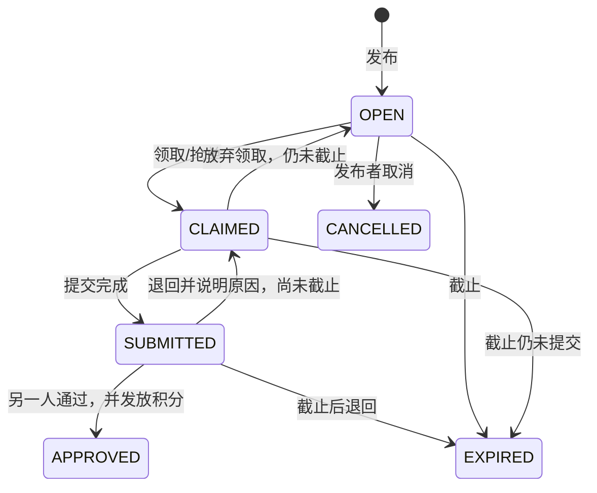
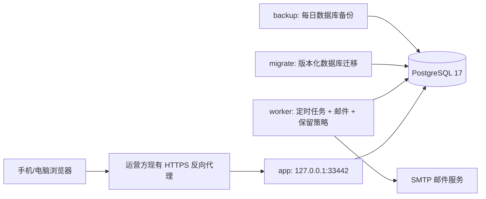

# 两个人 · 情侣任务与心愿小店

现行设计，更新于 2026-09-22。本文描述当前代码中的产品规则；实际验证与外部部署边界见验收记录。

## 1. 产品目标与范围

为一对情侣提供私密的共同空间。两个人都能发布任务、完成任务赚取积分、上架商品或服务，并用积分兑换空间中的心愿，包括自己发布的心愿，始终由另一半兑现。产品采用手机优先的响应式网页，电脑也能访问；提供应用图标与桌面快捷入口，业务操作需要联网。

当前提供邮箱密码注册与恢复、邀请配对、指定任务与双方抢单、一次性/每日/每周计划、完成审核、独立积分与流水、心愿库存和兑换退款、站内及邮件提醒、服务端分页、数据导出、账号注销、空间关闭及单机生产部署。

当前不包含小程序、原生 App、图片上传、积分充值/提现/转账、多人家庭、聊天、复杂积分惩罚、任意 Cron 或多机高可用。微信登录作为可选外部身份入口接入。没有真实货币支付；商品通常是双方自行兑现的约会、家务、礼物与服务。

## 2. 用户与空间

- 每个账号只能属于一个空间；数据库用两个固定成员席位保证空间最多两人。
- 创建空间后获得限时邀请码；伴侣注册后输入邀请码加入。邀请成功即失效，满员空间不再接纳第三人。
- 两人权限平等。发布任务、领取、上架与兑换需要空间已配对；等待伴侣时展示邀请入口和引导。
- 配对完成后双方必须分别确认第 1 版相处契约。契约确认前只开放契约阅读与确认，不开放任务、计划、心愿、兑换、积分和通知业务；服务端在空间上下文中再次校验，不能只依赖前端隐藏入口。
- 任务、商品和订单按当前空间隔离，个人通知和账本按用户隔离，当前积分列表还会筛选当前空间。后端检查身份及数据归属，不能靠前端隐藏按钮代替权限校验。
- 密码安全散列保存，会话使用 HttpOnly Cookie。提供退出、修改昵称、修改密码和邮件找回密码；重置链接 30 分钟一次有效，完成后撤销所有设备会话。微信身份只在后端关联，微信账号补充邮箱不会自动获得密码登录能力。
- 生产默认要求同意使用条款并验证邮箱。配置 SMTP 后注册自动发送验证邮件；未验证账号先完成邮箱验证，再创建或加入空间。微信新用户也需补充并验证邮箱。
- 数据导出包含本人资料、本人账本和通知，以及当前共同空间完整业务历史；不包含任何登录凭据、另一人的邮箱或其个人通知。

### 2.1 关闭空间与账号注销

双方任何一人可以在账号设置关闭共同空间，无需注销账号。操作需输入「关闭空间」，密码账号再次验证密码，只有微信身份的账号需在最近 10 分钟内重新登录。关闭不可恢复，会取消未完成约定、停用计划，并取消待兑现订单、退回积分及库存；已兑现和已确认记录保留当时结果，通知另一位成员。

关闭后双方仍可导出共同历史。各自输入「离开空间」后移除自己的成员关系，余额结算为 0 并记录流水，随后可创建或加入新空间；不把旧关系积分带入新空间，离开后也不再具有旧空间访问权。

注销账号另需输入「注销账号」并验证密码或近期微信会话。注销同时关闭当前空间，删除本人的登录身份、邮箱、安全令牌、邮件队列和个人通知，并以「已注销用户」保留共同业务历史与账本。它不等同于清空双方空间中的全部内容；已交给 SMTP 的邮件和保留周期内备份不能即时撤回。自动备份按策略滚动清理，手工与升级备份由运营方管理，恢复后需重新落实已生效的注销要求。

## 3. 任务设计

### 3.1 分配方式与发布时间相互独立

| 维度 | 选项 | 规则 |
| --- | --- | --- |
| 分配 | 指定给伴侣 | 仅另一位成员可以领取 |
| 分配 | 双方抢单 | 双方均可领取，包含发布者；先成功者独占 |
| 发布 | 立即 | 创建一个可领取实例 |
| 发布 | 定时一次 | 指定日期时间创建一个实例 |
| 发布 | 每日 | 每日北京时间固定时刻创建实例 |
| 发布 | 每周 | 每周选定星期与时刻创建实例 |

**为什么抢单允许发布者领取**：只有两个人的空间，如果排除发布者，永远只剩一个候选人。无论谁领取，都必须由另一人验收，禁止自己给自己发积分。

任务字段包括标题、要求、奖励积分（1～10,000 的整数）、分配方式与可选截止时间。计划任务使用“发布后多少小时截止”，限定 1～168 小时。发布后的任务要求和奖励冻结；要调整时取消尚未领取的实例并重新发布。

### 3.2 生命周期

- 领取者才能提交，完成说明选填，最多 3000 字符；不填写也可直接提交完成。提交者不能审核；退回必须提供原因。
- 截止前已提交的任务即使跨天，也能继续审核并获得奖励。
- 正常任务操作中，领取前可由发布者取消，领取后不能单方取消；领取者可在提交前放弃。空间关闭会统一取消尚未完成的约定。
- 审核通过、余额增加、流水记录在同一数据库事务完成。同一任务最多一次奖励。
- 抢单采用数据库条件更新/行锁，两人同时点击时只有一个成功，另一人看到明确提示。
- 周期模板与实例分开保存，仅计划发布者可暂停或恢复。暂停仅影响未来；恢复从下一个未来时刻开始。修改规则通过暂停旧计划、新建计划完成。

### 3.3 调度约定

统一存 UTC，日程固定按 `Asia/Shanghai`（北京时间）计算与标注。独立 worker 每 15 秒检查计划；正常运行的发布延迟通常不超过一个轮询周期。

同一期计划通过 `(schedule_id, scheduled_for)` 唯一约束防重。停机恢复只补发最近一次且尚未过期的期次，跳过过期旧期次，不集中生成过去几十天的任务。一次性定时任务过期后不再补发。每次执行记录 worker 心跳。

## 4. 积分与心愿小店

每人有独立积分账户，初始为 0。任务通过时系统增加完成人积分，不扣发布者积分。兑换消费的积分从兑换人账户扣除，不转给上架者。所有增减必须有不可随意修改的来源流水，不开放手动改分接口。

商品由双方自行上架，字段包括名称、说明、图标、积分价格（1～100,000）、库存、上下架状态。使用有限库存，可修改补货。两人都能兑换空间内的上架商品，包括自己发布的心愿；下架不影响已有订单。

兑换流程为 `PENDING 待兑现 → FULFILLED 已兑现 → COMPLETED 已确认`。扣除兑换人的积分，始终由另一位空间成员负责兑现，兑换人确认完成。商品创建人仍可管理商品，订单的 `seller_id` 表示实际兑现人。待兑现时兑换人可取消，兑现人可拒绝；取消会在同一事务中恢复积分、库存并记录退款。已兑现的订单不能单方取消。旧订单保持原角色，无需修改历史订单。

库存扣减、余额扣减、订单创建与积分流水写入必须全部成功或全部失败。余额及库存不允许为负。兑换请求携带幂等键，重复点击或网络重试不会重复扣分；重复取消不会重复退款。订单保存当时的商品名称、说明与积分价格快照。

## 5. 通知

- 站内通知：任务发布、领取、提交待审核、通过/退回、兑换待兑现、兑现/确认/取消。
- 邮件：相同关键事件可发送给需要行动的另一人，用户可关闭；未验证邮箱不发送业务邮件。
- SMTP 与可选微信配置由管理员在 `/admin` 后台保存，服务端使用加密密文存储，不写入普通生产环境文件。公开运营前管理员应检查 SMTP 连接、TLS 与认证；缺少配置不能开启正常邮箱验证流程。
- 业务事务仅写通知与邮件队列，worker 异步发送。失败按退避策略重试，达到上限保留失败记录，提供状态查询和重试入口。
- 邮件不承担业务状态变更；SMTP 临时故障不回滚已成功的任务、积分与兑换，但会影响账号验证/恢复和邮件送达。稳定 Message-ID 辅助去重，故障窗口仍可能产生重复邮件，不能承诺严格只发送一次。
- 提供六款可爱邮件模板，双方分别选择并在设置内预览；选择存储在 `users.email_theme`，发送时按收件人的最新偏好生成 HTML，同时携带完整纯文字正文。所有动态内容转义，不依赖外链图片。任务和订单邮件按钮进入对应页面，登录完成后继续定位。
- 发布（含定时任务）通知另一人领取；领取通知领取人的另一半；提交完成通知另一人验收；通过/退回通知完成人；兑换通知负责兑现的另一半，并写出心愿名称及积分。重复领取、通过验收、兑换重试和退款都沿用事务与幂等保护，不重复生成事件邮件。

## 6. 页面与视觉

名称暂定「两个人」，奶油白背景、草莓粉主色、深灰正文，搭配圆润卡片、少量笑脸爱心与礼物插画、柔和的贴纸色块。装饰融入现有标题和图标，不增加内容区块或滚动长度，操作按钮保持清晰。避免排行榜式竞争，优先帮助用户完成眼前的约定与兑换心愿。主导航只保留「约定、心愿、我们」，默认打开约定，取消独立首页和一级积分入口。

| 页面 | 主要内容 |
| --- | --- |
| 登录与配对 | 条款确认、注册、登录、密码找回、邮箱验证、创建空间、复制邀请码、加入空间 |
| 约定 | 当前/我的/待验收；发布、领取、提交、审核；按需展开搜索 |
| 心愿 | 可用积分、双方心愿、上架与兑换；待处理兑换提供快捷提醒 |
| 我们 | 双人空间信息、我的积分，以及兑换记录、历史约定、定时计划、消息、账号设置、邮件提醒的二级入口 |
| 我们 → 积分记录 | 任务奖励、兑换支出、退款及当前余额 |
| 我们 → 兑换记录 / 历史约定 | 兑现、确认和取消兑换；查看已完成、取消和到期的约定 |
| 我们 → 定时计划 / 消息 | 计划暂停与恢复；站内通知 |
| 我们 → 账号设置 / 邮件提醒 | 昵称和密码、微信绑定、邮箱验证、数据导出、关闭空间与注销；邮件偏好、失败重试和按需展开外观预览 |

手机采用底部导航，电脑采用侧边导航，两端保持相同的三项入口。二级页面提供返回「我们」的入口，低频账号操作按需展开。列表先显示少量内容，点击「再看」逐步展开并请求下一页；服务端每页默认 60 条、最多 200 条，通过游标继续读取完整历史。约定的搜索、当前/历史/我的/待验收筛选由服务端执行，通知未读数独立于当前页。已有邮件深链通过单条接口定位约定和兑换记录，不受首页分页截断影响。

新建约定优先填写名称、奖励和完成人，说明、发布时间、截止与重复收进「更多设置」；心愿优先填写名称、积分和图标，说明与可兑换份数按需展开。表单展示输入错误；执行中禁用重复点击；完成后反馈结果并刷新相关余额和列表。完成约定时可直接点「完成啦」；「给对方留句话」默认收起且选填，另一人验收后才获得积分。弹窗支持键盘关闭、焦点管理和可访问标签。

## 7. 技术架构

采用 TypeScript 全栈：React + Vite 前端、Fastify API、node-postgres 数据访问、PostgreSQL 17 数据库。API 与前端静态文件由同一服务提供，减少跨域和部署配置。SQL 迁移保留在仓库。

不引入 Redis。使用 PostgreSQL 行锁、事务与持久化邮件队列，部署范围为单台服务器。app 与 worker 共用构建镜像，以非 root 用户运行，生产根文件系统只读；数据库使用命名卷。生产 Compose 只运行 app、worker、db、backup，app 默认绑定 `127.0.0.1:33442`，HTTPS、域名和证书由部署环境已有反向代理提供。

### 数据实体

`users`、`sessions`、`auth_identities`、`oauth_states`、`spaces`、`memberships`（席位 1/2）、`email_tokens`、`tasks`、`schedules`、`wallets`、`point_ledger`、`products`、`orders`、`notifications`、`email_outbox`、`worker_heartbeat`、`password_reset_tokens`、`schema_migrations`、`maintenance_runs`、`creation_requests`。微信新账号的 `users.email` 与 `password_hash` 可为空，补充邮箱后仍需完成邮箱验证。

共同业务查询验证空间，个人数据按本人身份过滤。积分流水来源键唯一；订单幂等键按购买者隔离；任务周期键唯一；邮箱唯一；会话和安全令牌表仅保存摘要；待发安全邮件正文包含一次性链接，由保留策略清理。积分与库存数据库约束非负。关键流程使用事务并锁定业务记录，发生失败整体回滚。

创建约定、计划或心愿时，前端在本次表单中保持固定 `requestKey`，服务端按用户、空间、记录种类和请求键防重。同键同内容的网络重试返回已创建记录，不再次通知；同键提交不同内容返回冲突。`creation_requests` 只记录内容摘要与记录 ID，不保存表单原文，并随业务记录长期保留。

### 安全与稳定性

- 口令长度与输入长度校验，密码使用带随机盐的 scrypt；响应不包含散列或会话令牌。
- Cookie 为 HttpOnly、SameSite=Lax，生产强制 Secure；写请求检查 Origin 与 Sec-Fetch-Site，登录、注册、密码恢复及业务请求有限流。生产使用 CSP、HSTS 等响应头与请求大小限制；仅在受控代理后信任配置的代理网段。
- 微信登录使用一次性随机 state 和浏览器 HttpOnly nonce，状态保存摘要并在回调中原子消费；绑定时还校验发起绑定的原会话。AppKey 只在管理员后台加密配置并保留在服务端，不按昵称、头像或邮箱自动合并账号。
- 兑换、审核、退款等接口校验操作者角色，防止越权。
- React 默认转义内容，邮件用纯文本或转义内容，不把用户内容注入 HTML。
- 退出使会话失效；会话有有效期。日志不输出 SMTP 密码、口令或 Cookie。
- 密码找回使用短期一次性令牌及统一响应，避免枚举账号；新申请撤销旧链接，成功重置撤销全部会话。仅微信账号不会被找回流程转换成密码账号。

## 8. 部署与数据保留

生产入口为 `ops/install.sh` / `scripts/deploy.sh`。首次运行 `scripts/deploy.sh --init` 会从公开的 `production.env.example` 创建根目录 `production.env`，打印绝对路径并等待运营方填写；之后只需 `bash scripts/deploy.sh`。生产配置只负责监听端口、数据库和可信 `TRUST_PROXY`；域名与 HTTPS 由外部反向代理负责。可选 `APP_URL` 仅用于来源校验及邮件链接，SMTP、微信和后台支持联系方式在 `/admin` 配置。`COOKIE_SECURE=true` 保持开启。

使用 `ops/compose.production.yaml` 部署 app、worker、db、backup；不包含 Caddy，不占用 80/443，不申请证书，也不探测公网域名。反向代理须覆盖 `Host`、`X-Forwarded-Proto`、`X-Forwarded-For`，并将流量转发至 `BIND_ADDRESS`/`APP_PORT`。程序生成并保留数据库密码，使用带 Git 版本和唯一构建标签的镜像；升级停止写入后备份、执行迁移、检查积分对账和后台，再检查本地 HTTP `/api/ready`。失败保留数据库、旧镜像和备份，并停止业务服务。根目录 `compose.yaml` 只用于本地 development 体验。

数据库迁移先执行幂等基线，再按顺序执行带校验和的增量文件；已执行迁移不可修改。应用更新固定现有 PostgreSQL 镜像摘要、不自动重建数据库；数据库版本升级是单独的维护操作。

自动备份每天执行，默认至少保留 14 天；手工和升级前备份不会自动清理，需由运营方管理并复制到独立设备。恢复先校验归档和摘要、停止服务并备份当前库，导入迁移后在一次性容器中对账，成功后才恢复应用、后台和入口。完整操作见 [部署与运营](部署运营.md)。

后台维护每 24 小时最多成功一次，每类一次最多处理 5000 条。清理过期满 1 天的会话、过期满 7 天的 OAuth/邮箱验证/密码重置令牌、超过 90 天的终态邮件历史；安全邮件令牌过期满 7 天后清除正文链接及引用。仍在等待或发送中的邮件及其引用令牌保留，不删除账号、空间、任务、计划、心愿、订单、积分账本和站内通知。维护事务失败后可重试，使用独立锁避免多个 worker 重复执行。

## 9. 验证与实际运营边界

验收覆盖多组账号的注册验证和配对、第三人及跨空间保护、抢单与验收并发、扣分和退款幂等、调度防重、分页历史与深链、账号恢复和导出注销、空间关闭、邮件故障、生产配置拒绝、备份恢复及部署失败保护。最新执行结果统一记录在 [验收记录](验收记录.md)，不在设计文档复制测试数量或提交状态。

目标服务器、真实 DNS/证书、真实 SMTP 收信以及可选微信授权需要目标环境验证。当前文档和默认使用说明不代替运营主体依据所在地完成的备案、隐私和其他经营要求，也不承诺多机高可用。启动方式见 [README](../README.md)，运维以 [部署与运营](部署运营.md) 为准。
