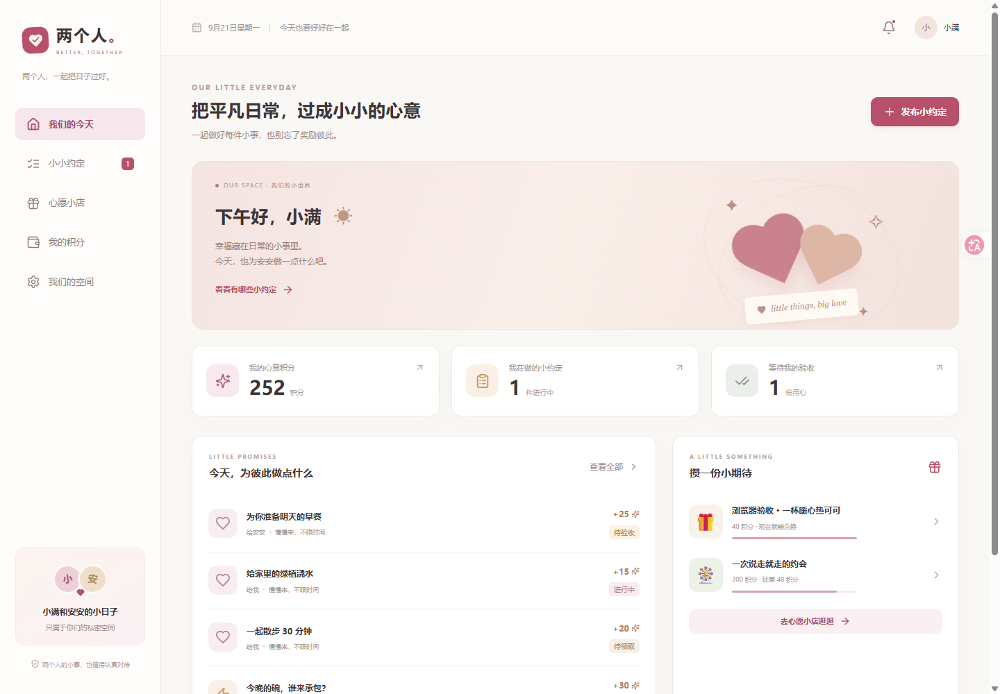
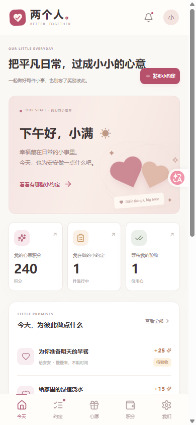
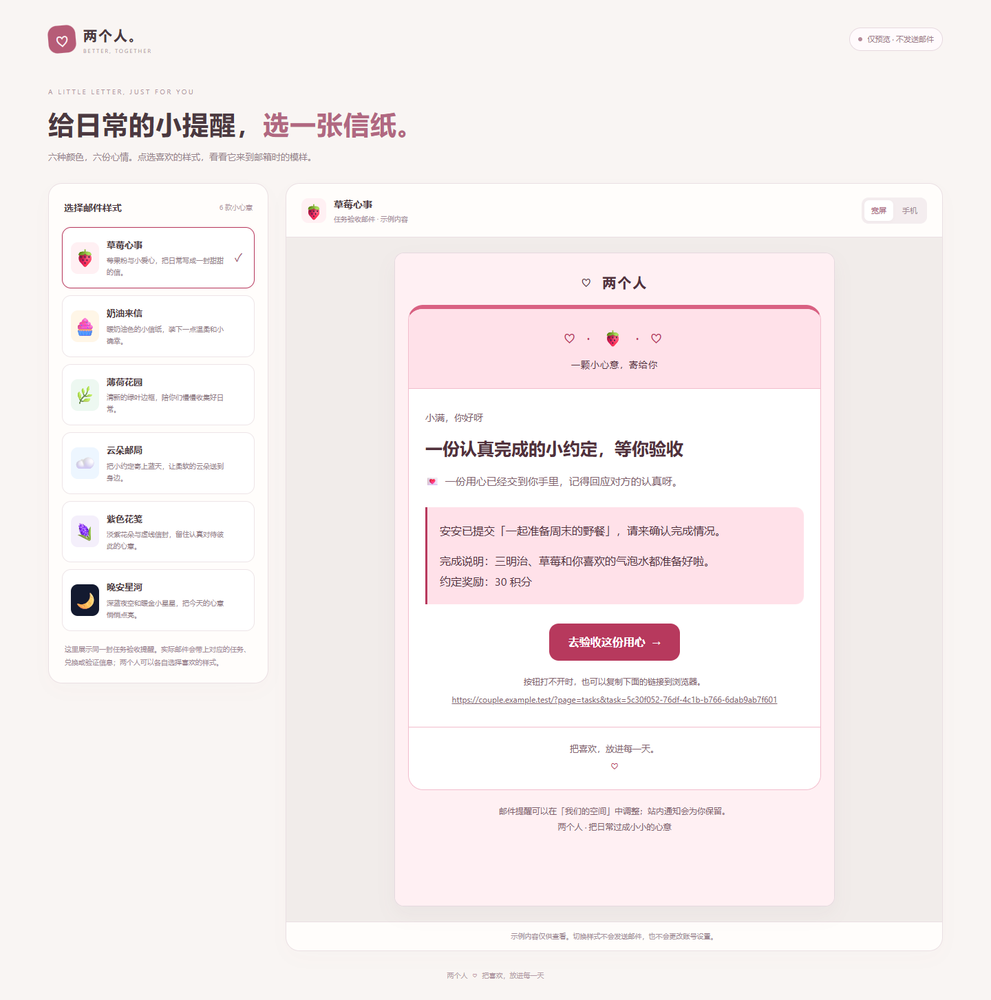

# 首版验收记录

日期：2026-09-22。先完成产品设计与接口契约，再实施首版开发。

## 已通过的验证

| 项目 | 结果 |
| --- | --- |
| TypeScript 类型检查 | 通过 |
| 生产构建 | React 静态资源、Node 服务、SQL 迁移文件全部生成 |
| 自动化测试 | `npm test` 报告 85 项通过，0 失败，0 跳过；其中微信业务专项 31 项、日志及请求超时 2 项（计入嵌套测试）；本轮增加自兑换、邮件流程与模板验证 |
| 数据库 | 真实 PostgreSQL 17.6；独立临时测试库，不使用内存模拟数据库 |
| 邮件 | 仅本地 SMTP 接收器，验证发送、并发领取、失败退避、手动重试及 HTML/纯文字双格式；入队后修改主题，实际发送使用最新主题 |
| 积分对账 | 演示空间两个账户的余额均与流水总和一致 |
| 后台心跳 | worker 正常运行，心跳检查通过 |
| 依赖安全扫描 | `npm audit` / 生产依赖扫描未报告已知漏洞 |
| Compose 静态检查 | YAML 合并、迁移依赖、数据库连接、端口隔离、健康检查均符合设计 |

自动化覆盖账号配对、第三人限制、跨空间访问、跨站写请求、并发抢单、非领取者提交限制、自审禁止、重复审核、退回重提、截止后验收、兑换幂等、最后一件库存、余额不足、并发取消退款、商品价格快照、履约权限、不同商品同时消费、调度防重、过期跳过、停机补发、计划暂停恢复、通知已读、邮箱令牌、邮件偏好变更、旧租约回收和五次耗尽。

微信登录测试使用本地模拟北辰响应，不调用真实微信或第三方接口，覆盖配置关闭或缺少密钥、首次微信登录创建零余额无邮箱账号、重复身份复用用户、已有邮箱账号绑定后保留空间与积分、状态和浏览器 Cookie 防重放、过期状态、绑定会话变更/撤销/过期、身份交换期间退出、绑定冲突不合并以及并发登录只创建一个本地账号。还覆盖上游失败/未完成授权/错误身份类型、不安全或泄露密钥的授权地址、补邮箱 SMTP 条件与邮箱冲突、验证后仍不能用密码登录。独立测试捕获真实 Fastify 日志验证授权参数隐藏，并用真实 AbortSignal 验证授权请求和身份交换会超时中止。

另外验证补库存到手动输入上限后，旧订单仍能退款并归还库存；同一幂等键不能用于另一商品；取消与兑现竞争只产生一个结果；退回后放弃任务可由原验收者重新领取。

本轮新增验证自己上架的心愿可兑换，由另一半兑现；重复请求只扣一次，兑换人确认收货，取消退款及库存恢复正确。指定任务和抢单任务的发布、领取、提交、验收，以及定时发布、心愿兑换，均核对通知收件人、正文和任务/订单链接；重复领取、审核和调度不会重复生成事件邮件。

邮件模板测试覆盖六款主题与全部事件（兼容旧 `TASK_PUBLISHED`），动态内容转义、不安全/跨域链接拒绝、默认主题回退、完整纯文字正文及邮箱验证链接。模板目录要求登录，个人选择分别保存，不能覆盖伴侣选择或意外改动通知开关。

## 真实浏览器检查（首版五项导航，历史记录）

使用 Tabbit 浏览器操作本地构建后的应用，不依赖静态页面截图代替功能检查。

- 手机尺寸完成发布抢单任务、领取、提交、退出并切换伴侣、验收发分。小满积分由 240 变为 252。
- 商品兑换扣除 100 积分，取消后退回；检查订单显示已取消及余额恢复。
- 上架商品、修改价格、下架和重新上架成功。
- 每周五 19:30 计划创建成功；暂停和恢复后，下一次发布为 2026-09-25 19:30 北京时间。
- 375px 与 1440px 宽度下遍历首页、任务、小店、积分、设置，共 10 个页面尺寸组合，没有页面水平溢出。
- 浏览器重新加载及上述页面切换期间未捕获 JavaScript 页面异常。
- 重新构建后在 390px 手机尺寸检查登录页微信入口、已登录设置页的绑定状态和未配置提示；入口按配置正确禁用，绑定区域无横向溢出。
- 最终版本用模拟接口状态检查微信新用户配对引导、补充邮箱、已补邮箱的发送/重发验证入口、已有账号绑定请求、授权失败提示、回调成功/失败后的地址栏清理。375px、390px、768px、1440px 的微信账户区与长邮箱没有横向溢出；这些是页面交互检查，不等同于真实微信扫码联调。
- 390px 手机截图与 1440px 桌面截图已保存，见下方。
- 本轮真实 API 下验证两人分别保存「晚安星河」和「薄荷花园」，刷新后保留且互不影响；375px 和 1440px 宽度逐一检查六主题，页面及邮件 iframe 共 12 个组合没有水平溢出。
- 手机端兑换自己上架的「不用早起的周末」，确认扣除 100 积分并显示由安安兑现；取消后余额恢复到 252，订单标记已取消。
- 任务邮件链接能直接打开任务详情；订单链接能高亮对应记录，退出登录后打开链接再登录另一账号仍能定位，并正确显示兑换人与兑现人。
- 邮件预览检查未发现应用自身脚本异常；浏览器已安装扩展对隔离 iframe 报出的 `postMessage` 错误，其堆栈来自 `chrome-extension://`，与应用代码无关。

检查中修复了北京时间问候、手机非 HTTPS 环境的兑换请求编号生成、商品编辑覆盖实时库存、排队后关闭通知，以及从兑换记录页上架商品后切回商品列表的问题。

六款邮件的 [独立预览册](email-preview.html) 支持切换样式和阅读宽度；已在浏览器检查全部切换和 375px 手机页面布局。

[手机设置中的晚安星河预览](screenshots/email-night-mobile.png)

## 尚未实测与首版边界

1. **Docker 容器构建与启动未实测**：当前电脑未安装可用的 Docker 命令或引擎。已验证本地生产构建、真实数据库业务流程和 Compose 静态配置，不能据此声称 Docker 已实际运行。
2. **真实邮件外发未执行**：需要部署者配置 SMTP；本次没有向任何真实邮箱发送消息。
3. **真实北辰/微信联调未执行**：需要部署者填写 `BEICHEN_APP_ID`、`BEICHEN_APP_KEY`、最终 `APP_URL`，在北辰后台登记域名并确认动态状态回调路径的白名单规则。
4. **备份恢复命令尚未完成演练**：开发用 PostgreSQL 包未包含 `pg_dump`/`pg_restore`，部署说明中的命令面向带有这些工具的官方 PostgreSQL Docker 镜像。上线前应在该环境做一次恢复演练。
5. 首版不含忘记密码、图片上传、成员更换、解除配对和服务端历史分页；接口各最多返回最近 200 条任务、计划、商品、订单、流水及 100 条通知，界面通常先显示 6 条并按需展开，完整历史仍保存在数据库。
6. 数据库迁移目前为首版幂等建表及兼容修正，未来破坏性结构变更应新增版本化迁移并先备份。

本地演示不是生产数据，使用保留测试邮箱、示例任务和商品；浏览器验收留下的记录也仅存在于本地开发库。生产 Compose 不自动导入演示数据。

## 2026-09-22 端口调整与洁癖收尾（历史记录）

本节是当次版本与运行现场的验证快照，不代表后续下载副本或 GitHub 最新提交的当前状态。

应用监听、默认公开地址、Compose 内外端口、健康检查、开发代理和测试示例统一为 `33442`。Vite 热更新仍从 `5173` 访问，代理后端 `33442`。本地环境已更新并重启 app 与 worker；原应用 `3000` 端口不再监听。

本轮重新执行 85 项自动化测试、类型检查、生产构建、代码格式检查，全部通过；生产依赖审计未发现已知漏洞。Compose 合并配置的端口、迁移依赖、健康检查和数据库端口隔离静态断言通过。`http://localhost:33442/api/health` 返回正常，后台心跳与积分对账通过。

真实浏览器在新端口检查首页、任务、心愿、积分、设置五页，390px 宽度无水平溢出；原登录会话继续可用，同源保存设置请求返回 200，六款邮件模板正常加载。

| 事实面 | 状态 | 证据与处理 |
| --- | --- | --- |
| 代码 | changed-and-verified | 默认端口全链路更新，构建及 85 项测试通过 |
| 本地运行态 | changed-and-verified | 33442 页面/API、写请求、worker 和余额流水检查通过 |
| 文档 | changed-and-verified | README、设计与接口合同对齐现状；本地文档链接检查通过 |
| 项目规则 | changed-and-verified | 新增精简 `AGENTS.md` 作为协作入口，链接现有权威文档 |
| Agent 记忆 | out-of-scope | 不改全局配置或宿主生成记忆，无需新增第二份项目事实 |
| 工作区 | verified-current | 仅项目源码、公开文档、演示截图与配置示例纳入提交；凭据、依赖、构建、本地数据和备份均忽略 |
| GitHub 源码发布 | verified-current | [1075375006/liang-ge-ren](https://github.com/1075375006/liang-ge-ren) 为公开仓库，默认 `main`；匿名 API 可读取，远端文件树与本地提交一致 |
| 生产部署及外部服务 | pending | Docker 运行、真实 SMTP/微信及备份恢复仍待目标环境实测，不以源码公开代替上线验证 |

当次现场曾记录两份 `.local/` 浏览器调试脚本；本轮工作区已不存在这两份文件，不再列为待清场候选。当前 `dist/`、`node_modules/` 和 `.local/postgres/` 仍用于本地运行，保留且不上传。

## 2026-09-22 手机前端简化

主导航改为「约定、心愿、我们」，默认打开约定；移除独立首页，积分、兑换记录、历史约定、计划及各项设置从「我们」进入。以下验证对应三项导航的新界面；上方首版截图及五页检查属于改版前的历史记录。

- `npm run build` 通过，`npm test` 85 项通过、0 失败；额外的 TypeScript 未使用变量/参数检查通过。
- Tabbit 真实浏览器连接本地 Vite（5173）及 Fastify（33442），使用新建本地演示库。320、375、430、1280px 下遍历三个主页面，共 12 个尺寸/页面组合，无水平溢出；390px 三个主页面已截图检查。
- 真实页面检查三项导航、二级页面高亮「我们」、浏览器后退、历史约定、搜索空状态与默认折叠的发布表单。
- 从「定时计划」新建默认每天重复并展开设置；约定时间与心愿份数清空后收起，提交会自动展开无效字段，不会误发布。
- 真实 API 下兑换演示心愿后直达兑换记录；取消后状态为已取消，余额从 240 扣至 140 后回到 240；`check:ledger` 确认两账户余额均与流水一致。
- 旧订单邮件链接能进入新的兑换记录页，高亮目标并清理地址栏查询参数。
- 使用浏览器拦截的前端测试数据单独覆盖长列表：8 条约定先显示 6 条，按需展开至 8 条；旧邮件链接能展开并定位第 10 条订单。这部分属于模拟列表交互验证，不是新增真实订单的业务验证。

本轮没有执行生产部署、真实邮件外发或微信扫码；这些边界沿用上文说明。浏览器检查使用保留测试邮箱，本地演示兑换已取消并退回积分。

### 本轮知识核对

本地下载副本已接回原仓库 `main` 历史，核对基线为 `a69b3df`，工作目录文件未被远端覆盖。当前提交同时交付手机界面与对应产品说明，旧五页界面和端口收尾凭证已明确标为历史。

| 事实面 | 状态 | 证据与处理 |
| --- | --- | --- |
| 代码 | changed-and-verified | 三项导航、二级入口及简化表单；85 项测试、类型检查和生产构建通过 |
| 本地运行态 | verified-current | 5173 预览与 33442 API 可用；本轮启动开发 worker，心跳及两账户积分对账通过 |
| 文档 | changed-and-verified | README、产品设计、接口、微信接入与验收记录对齐当前入口、权限及列表边界；项目内 Markdown 链接均有效 |
| 规则 | changed-and-verified | AGENTS.md 同步三项主导航；运行命令、路径和忽略规则核对通过 |
| Agent 记忆 | out-of-scope | 没有项目人工记忆需维护；不修改宿主生成记忆或全局配置 |
| 工作区 | changed-and-verified | 已恢复 Git 版本管理；依赖、构建和开发库均在忽略范围，不纳入源码提交；未发现需要删除的会话残留 |
| 生产及外部服务 | pending | Docker 运行、真实 SMTP/微信和备份恢复仍需目标环境实测；源码推送不代表生产部署 |

源码发布目标为公开仓库 `1075375006/liang-ge-ren` 的 `main`；提交历史是版本凭证。此次只保留必要的本地运行目录，未执行删除或清场，没有待用户确认的删除候选。
